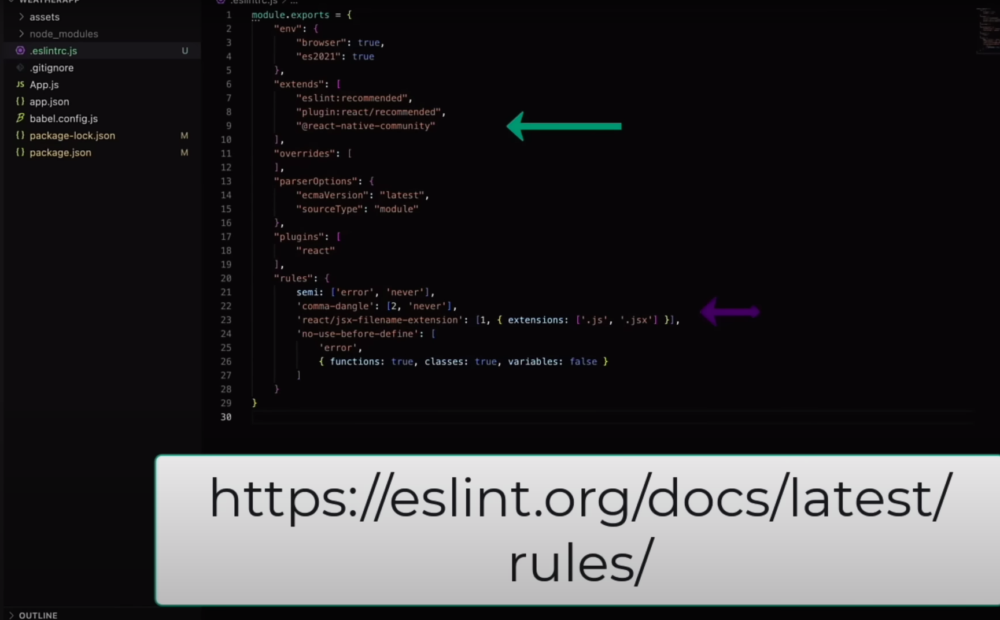
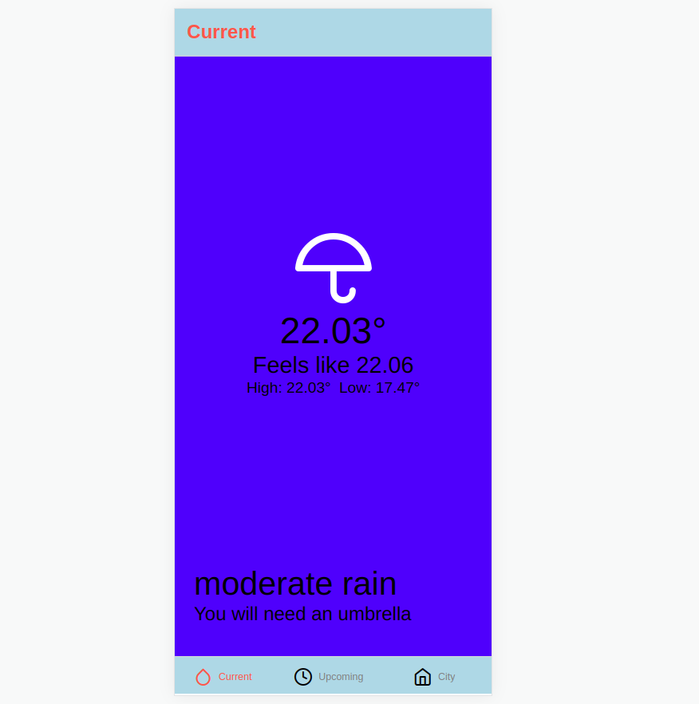
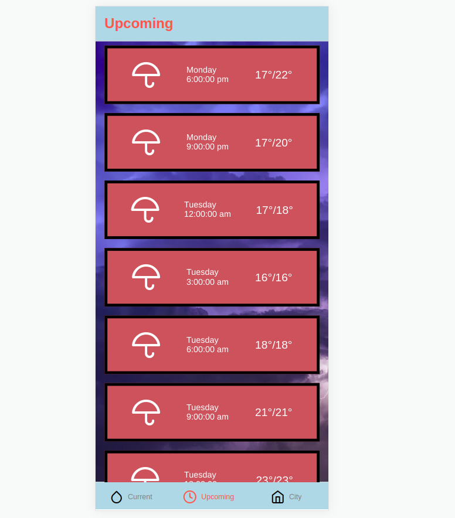
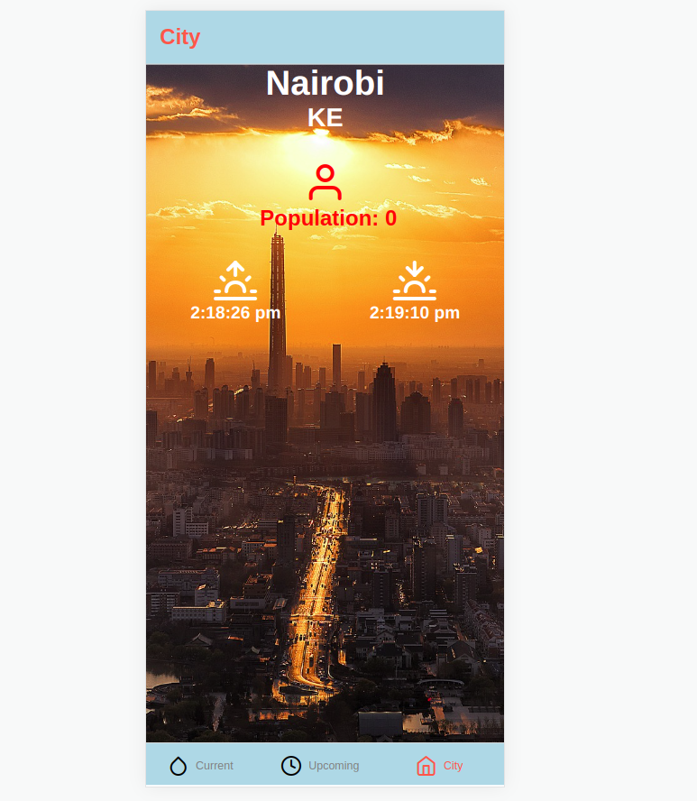
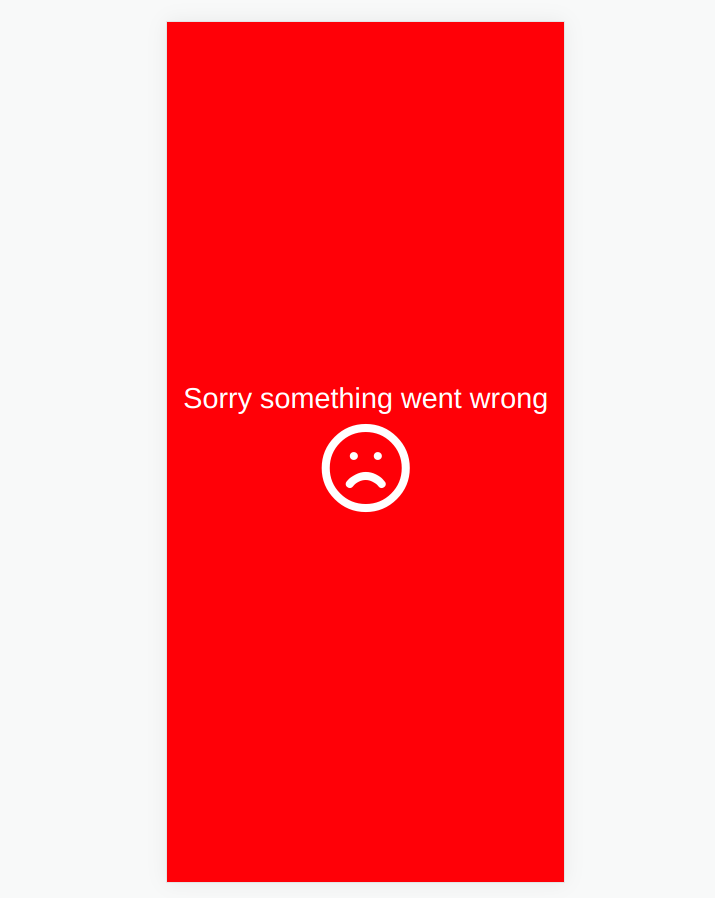

# WeatherApp
- react-native vector icons

## What is Expo?
- An external platform to help us build and run our application
- it is not compulsory to use Expo but it can save a lot of time especially if you are just getting started

## Getting our environment started
### 1. Using expo
1. ensure recent version of ``node`` is installed.
2. install ``expo-cli``
```
npm install -g expo-cli
```
3. create our project run
```
npx create-expo-app WeatherApp
```
4. navigate to our project ``cd WeatherApp`` and run it by typing
```
npm start
```
5. install client expo from app store or google store
6. scan the Qcode using camera to run app on your phone. At this point you should see the app running

### 2. Using React Native CLI
1. you need to have a mac
2. have ``node`` and ``watchman`` installed
3. have correct version of ``ruby`` installed
4. install ``xcode`` from app store
5. install ``cocoapods`` from ``cocoapods.org``

#### NB
if you previously installed a global ``react-native-cli`` package, please remove it as it may cause unexpected issues:
```
npm uninstall -g react-native-cli @react-native-community/cli
```
6. create our project by typing
```
npx react-native init WeatherApp
```
7. navigate to our project and run by typing the following two command in separate terminals
```
npx react-native start
```
```
npx react-native run-ios
```
8. you can see our app starts inside the simulator

### 3. Using Android Studio
1. make sure ``android studio`` is downloaded and installed
2. set up emulator: ``open android studio`` > ``more actions`` > ``Virtual Device manager`` > ``Create device`` and follow the process to configure device
3. run the emulator
4. now we can close android studio and type
```
npx react-native run-android
```
5. We'll see our app run on emulator

## eslint
- for working with our project we'll install ``eslint - development dependency``
```
npm install eslint --save-dev
```
- initialize ``eslint``
```
npx eslint --init
```
- ``Ok to proceed? (y) y`` > ``To check syntax and find problems`` > ``JavaScript modules (import/export)`` > ``React`` > ``Does your project use TypeScript? No`` > ``Browser`` > ``JavaScript`` > ``Would you like to install them now? Yes`` > ``npm``
- after this is done we should have a ``.eslintrc,js`` file created

## install react-native-community
```
npm install @react-native-community/eslint-config --save-dev
```
6. adding the following customized extra rules
<!--  -->


7. add a script for running ``eslint`` inside ``package.json``:
```
  "scripts": {
    "start": "expo start",
    "android": "expo start --android",
    "ios": "expo start --ios",
    "web": "expo start --web",
    "lint": "eslint ."     <===//this one
  },
```
8. to run it type:
```
npm run lint
```

## Whai i have learned
1. Setting up an app with expo.
2. Create and import a component.
3. Basic styling.

## Lists in react-native
1. FlatList
2. SectionList
3. VirtualizedList


| FlatList | SectionList |
| :-----: | :---------: |
| think  of this as a standard list | when you need a list broken up into sections |
| required props: Data and renderItem | required props: Sections and renderItem |
| data must be an array | data must be an array of objects |
| renderItem displays the list element to the user | RenderItem displays the list element to the user |
| 

## keyExtractor
- Used to extract a unique key for a given item at the specified index. Key is used for caching and as the react key to track item re-ordering. The default extractor checks item.key, then item.id, and then falls back to using the index, like React does.

### Requirements of keyExtractor
- must be a string
- each element must have its own unique ID
- the key can be added to the data or we can use the keyExtractor prop

## Images
### NB//
- network images must have a height set
- when sizing images you can use a height and width or you can use a heigt and width or you can use aspect ratio with the height and/or the width
- be mindful of storage sizes when you are using static images
- used `` pixabay.com `` website for free images

## ImageBackground
- A common feature request from developers familiar with the web is background-image. To handle this use case, you can use the ``` <ImageBackground> ``` component, which has the same props as ``` <Image> ```, and add whatever children to it you would like to layer on top of it.

## Props
- prop is short for property
- they are used to pass data from parent to child
- we can use props to customize our components
- promotes componet reusability

### NB//
- props are immutable so they can't be changed once the component is created
- we use unidirrectional data flow to pass the props from the parent to the child
- unidirectional data flow means the data can only move in one dirrection

## React Native Navigation
- is a react native library used to implement navigation between screens
```
npm install @react-navigation/native
```

### NB//
- to get us working and our app running since we use expo run 
```
npx expo install react-native-screens react-native-safe-area-context
```
## Setting tabs

### for this project we use bottom tabs
```
npm install @react-navigation/bottom-tabs
```

## Styling our Tabs
- colors and icons

## Dynamic
### State
- State is and object that contains information about a component that we want to track.
- In the object we use key-value pairs
- Helps us to add, remove and modify things in our component
- we can trigger Ui updates based on the changes
- when state changes the omponent re renders

### useState
- when we use the ``useState`` hook we are setting up some piece of state for our component.
- to ``useState`` we pass in an initial or default starting value for the piece of state.
- for the flooded room example we might say the following:
```
const [isFlooded, setIsFlooded] = useState(false)
```
- the square brackets are using array destructuring.
- the first value is the piece of state and the second is a function to update the state.

## Stateful and Stateless functions
| Stateful | Stateless |
| :-----: | :---------: |
| For components `with` state | for components `without` state |
| created with a class | created with a function |
| 

### Component lifecycle stages
1. componentDidMount
2. componentDidUpdate
3. componentWillUnmount

### NB//
- hooks were introduced in React 16.8
- hooks mean we no longer have to depend on classes for state and lifecycle methods.
- hooks are like special functions containing reusable logic
- every hook starts with the word ``use``

### useEffect
- lets us perform side effects within our function components
- we can pass in a dependency array which lets you specify what data, when changed, you would like to trigger a re-render
- we can additionally use a cleanup function to stop any of our side effects before the component unmounts

### adding a Loading state
- used when data is fetched

#### ActivityIndicator
- displays a circular loading indicator

## Geolocation
### Expo Location
``expo-location`` allows reading geolocation information from the device. your app can poll for the current location or subscribe to location update events.
```
npx expo install expo-location
```

### react-native-dotenv
- used so that we do not expose our keys online
```
npm install -D react-native-dotenv
```
- add this line of code to ``babel.config.js``
```
plugins: ['module: react-native-dotenv']
```
- now we can create our ``.env`` file
- add our ``.env`` file to ``.gitignore``

## Fetch API
- using our weather api key

## Building our own hook
- building your own hooks lets you extract component logic into reusable functions.

## moment.js
- library used to format date & time
```
npm install moment --save
```
## useContext
- ``useContext`` provides a way to pass data through the component tree without having to pass props down manually at every level
## Buttons
### TouchableOpacity
### TouchableWithoutFeedback

## App Overview

<div style="display:flex; flex-direction:row; flex-wrap:wrap; gap:10px">
<!--  -->


<!--  -->


<!--  -->


<!--  -->

</div>